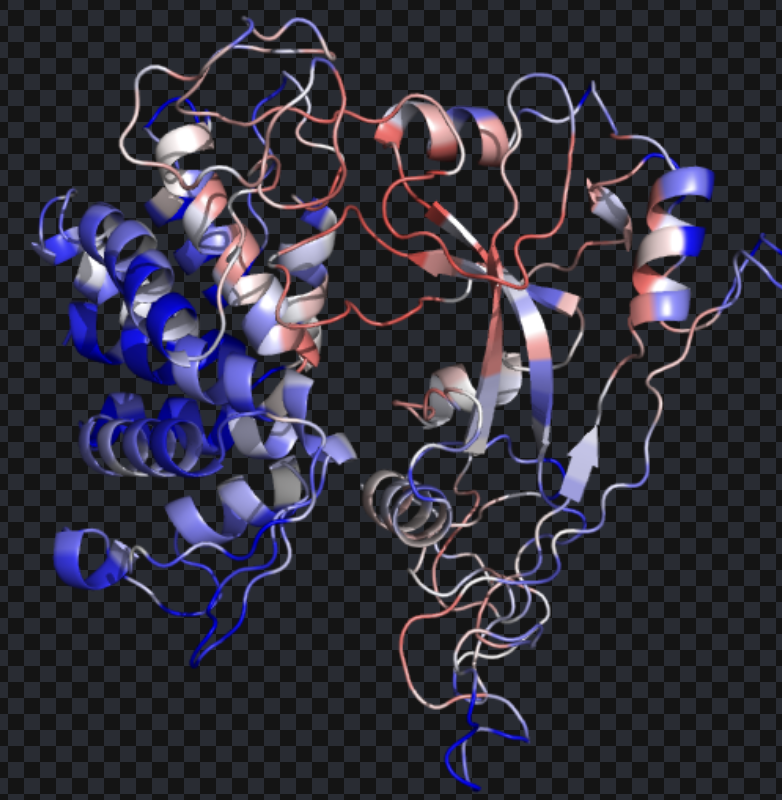
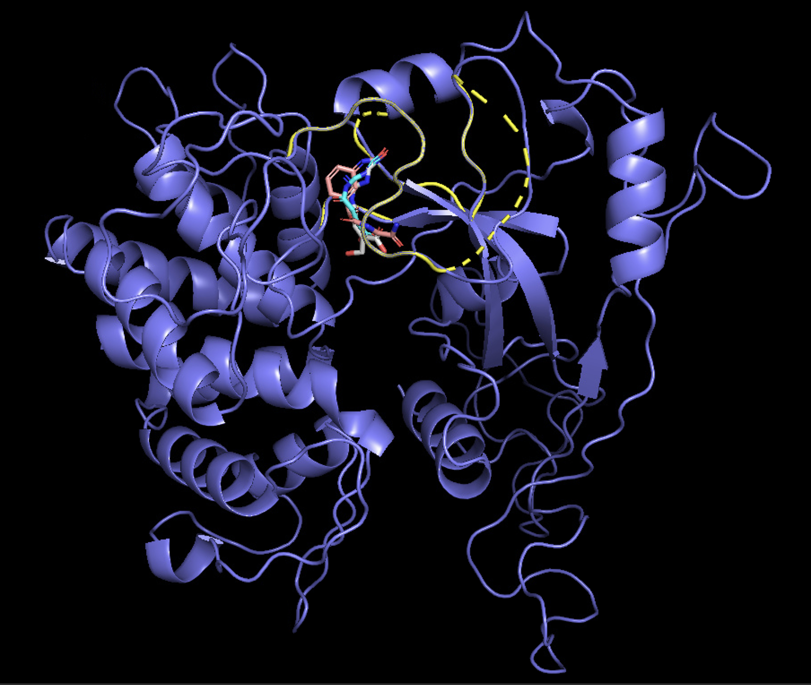

# To generate a small molecule in a probable protein cryptic pocket

Environment config:
`conda env create -f config.yaml`

To predict a cryptic pocket position using 3d-cnn by pocketminer, in the directory cryopogen, and get a probable pocket, example run:

```
python3 ./pocket_pred/gvp-pocket_pred/src/predictposition.py --strucs ./example/gsdmd_swmodel.pdb  --output_folder example --output_name predict
```


This command will generate a probable pocket as pocket.pdb according to pocketminer predicted pocket, which is the most likely to be a cryptic pocket.



The uni-transformer modle used for sampling is retrained by:
```
python scripts/train_diffusion.py configs/training.yml
```


To sample molecules in the pocket using base model targetdiff（transformer model）, in pocketgen folder(`cd pocketgen`), run:


```
python3 scripts/sample_for_pocket.py configs/sampling.yml --pdb_path ../example/pocket.pdb --num_samples 20  --result_path ../example/sample
```

The sampled molecules are inside pocketgen/outputs_pdb/sdf folder
the example shows:




